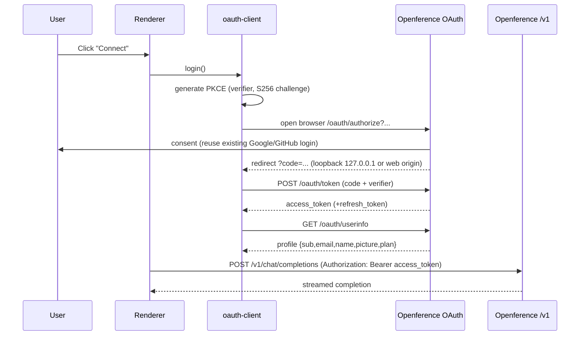

# Deyin Architecture

Deyin is an original agentic development environment (ADE). It is not a fork of any
proprietary application; every component in this repository is written from scratch.
Where third-party code is used, it is a permissively licensed open-source dependency
declared in the relevant `package.json`.

## Design goals

1. **One codebase, two runtimes.** The renderer (UI) is a plain web SPA. It runs
   unchanged inside an Electron shell (desktop) and behind a web server (browser).
2. **Backend-authoritative host.** All privileged operations (spawn a PTY, read/write
   files, run git, drive a headless browser) happen in a "host" process. On desktop the
   host is the Electron main process; on web it is a per-session container. The renderer
   never touches the OS directly.
3. **Transport abstraction.** The renderer talks to the host through a single typed RPC
   channel. On desktop the channel is Electron IPC; on web it is a WebSocket. The
   renderer picks the transport at runtime based on capability detection.
4. **Openference for identity and models.** Authentication is OAuth 2.0 + PKCE against
   Openference. The resulting access token is the bearer credential for the
   OpenAI-compatible model endpoint at `https://api.openference.com/v1`.

## Component map

```
┌─────────────────────────────────────────────────────────────────┐
│ Renderer (@deyin/ui, packages/ui/client)                          │
│  - React SPA: task sidebar, chat, model picker, skills, settings  │
│  - Talks to host via RpcTransport (IPC or WebSocket)              │
│  - Talks to Openference via oauth-client (token) + model API      │
└───────────────┬───────────────────────────────┬──────────────────┘
                │ RpcTransport                    │ HTTPS (Bearer)
                ▼                                 ▼
┌───────────────────────────────┐   ┌──────────────────────────────┐
│ Host (packages/host-core)      │   │ Openference                   │
│  - PTY (node-pty)              │   │  - OAuth provider             │
│  - File system service         │   │    (packages/oauth-provider)  │
│  - Git service                 │   │  - /v1 model gateway (exists) │
│  - Process/exec service        │   └──────────────────────────────┘
│  - Skills / plugins registry   │
└────────────────────────────────┘
        ▲                     ▲
        │ Electron IPC        │ WebSocket
┌───────┴────────┐   ┌────────┴─────────────┐
│ apps/desktop    │   │ apps/web/host-server │
│ (Electron main) │   │ (Node, per session)  │
└─────────────────┘   └──────────────────────┘
```

## Packages

| Package | Purpose |
| --- | --- |
| `@deyin/extension-api` | The zero-dependency contracts plugins are written against: `PluginDefinition { name, inject, provides, activateOn, apply(ctx, config) }`, `PluginContext` (services, events, waterfalls, scopes, effects), and config-row types. Bottom of the dependency graph. |
| `@deyin/kernel` | The plugin runtime: topological activation over `provides`/`inject`, per-plugin failure isolation, scoped service registry, event bus + waterfall middleware, lazy activation on event patterns, and config-layer resolution (bundle → profile → user/workspace patches) with `dumpConfig()`. |
| `@deyin/oauth-provider` | Standalone OAuth 2.0 / OIDC server (authorize, token, userinfo, device, introspect, revoke, discovery). Deployable on Node or Cloudflare Workers. |
| `@deyin/oauth-client` | Reusable PKCE client for desktop (loopback), CLI (device flow), and browser (redirect). Handles token storage and refresh. |
| `@deyin/host-core` | Runtime-agnostic host services (PTY, files, git, exec, skills). Consumed by the Electron main process and the web host-server. |
| `@deyin/contract` | The typed RPC contract shared by every frontend and host: the IPC channel map (`CH` / `DeyinApi`), domain type re-exports, service config, and the web client ↔ host-server WebSocket protocol (`@deyin/contract/web`). |
| `@deyin/ui` | The one renderer SPA (React), consumed as source by each app's bundler. The app entry injects the transport (preload IPC on desktop, WebSocket in the browser). |
| `@deyin/optimization-plugin` | Semantic caching (embeddings, tool-result cache, response cache) — the first code-level plugin on the kernel, loaded by the desktop profile. |
| `@deyin/branding` | Deyin logos, icons, and theme tokens. |

## Extension model

Deyin runs a dsh-style "everything is a plugin" architecture inside this
monorepo. Direction of dependencies is fixed:
`apps → plugin packages → @deyin/kernel → @deyin/extension-api`. A capability is
a *seam* (a `ServiceKey` declared next to its definition) plus swappable
*provider* plugins; consumers depend only on the seam, never a concrete
provider.

**Seams live today:** `tools` (a `ToolCatalog` that the six family plugins —
fs, shell, git, web, plan, agent — register into; run registries build from
the catalog), `llm` (adapter registry keyed by wire format with fallback to
the agent-core dispatcher; openai/responses/anthropic adapters), `capabilities`
(sandbox-scoped scan for skills/commands/subagents/hooks/mcp), `optimization`
(lazy semantic caches). The agent loop, tool registry, and model adapters are
no longer privileged — desktop and web hosts compose the same rows.

A running process is composed from config layers
(`@deyin/bundle-base → profile (@deyin/bundle-desktop-app / web-app / headless)
→ user patch → workspace patch`), each a list of plugin rows patched by id, so
composition is configuration, not code; `kernel.dumpConfig()` prints the
resolved tree. One broken plugin fails in isolation and surfaces in the
Plugins settings page ("Kernel plugins"); the host keeps running. Untrusted
third-party code stays out-of-process behind MCP.

**Session event log spine:** agent-core's `SessionStore` is the primary,
append-only session store. Every session is one JSONL log: a meta record,
then an ordered stream of events — model-visible messages plus lifecycle
facts (`session-created`, `forked`, `title-set`, `compaction`). Transcripts
are derived on load; `events(id)` replays the raw log; `fork(id, {atSeq})`
creates a new session whose log is a verbatim prefix copy with fork
provenance in its meta and log. Appends carry a self-healing newline
boundary so a torn write can never swallow the next record, and legacy
v1/v2 logs replay and fork unchanged through the on-load migration. The
web session host additionally journals live UI events into the sandbox
(`@deyin/host-core` `SessionEventJournal`) for reconnect/replay.

## Apps

| App | Purpose |
| --- | --- |
| `apps/desktop` | Electron shell. Main process embeds `@deyin/host-core`; the renderer is `@deyin/ui`, built by electron-vite from `packages/ui/client`. |
| `apps/web` | Web deployment: static renderer (`@deyin/ui`) + `host-server` (WebSocket, one sandboxed session per authenticated user). |

## Auth + model data flow



## Why original code instead of forking a proprietary bundle

A rebranded copy of a third-party compiled application is legally and technically
unsound: it reproduces copyrighted software, breaks on every upstream release, and
cannot be legitimately redistributed. Building original components means Deyin can be
open-sourced, self-hosted, deployed to the web, and extended without those constraints.
