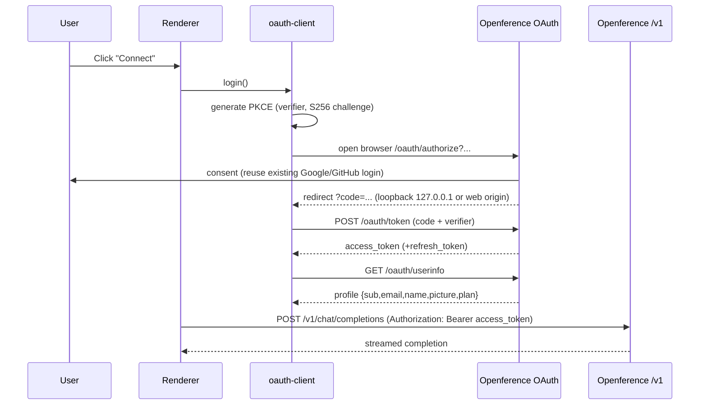

# Deyin Architecture

Deyin is an original agentic development environment (ADE). It is not a fork of any
proprietary application; every component in this repository is written from scratch.
Where third-party code is used, it is a permissively licensed open-source dependency
declared in the relevant `package.json`.

## Design goals

1. **One codebase, two runtimes.** The renderer (UI) is a plain web SPA. It runs
   unchanged inside an Electron shell (desktop) and behind a web server (browser).
2. **Backend-authoritative host.** All privileged operations (spawn a PTY, read/write
   files, run git, drive a headless browser) happen in a "host" process. On desktop the
   host is the Electron main process; on web it is a per-session container. The renderer
   never touches the OS directly.
3. **Transport abstraction.** The renderer talks to the host through a single typed RPC
   channel. On desktop the channel is Electron IPC; on web it is a WebSocket. The
   renderer picks the transport at runtime based on capability detection.
4. **Openference for identity and models.** Authentication is OAuth 2.0 + PKCE against
   Openference. The resulting access token is the bearer credential for the
   OpenAI-compatible model endpoint at `https://api.openference.com/v1`.

## Component map

```
┌─────────────────────────────────────────────────────────────────┐
│ Renderer (apps/desktop/src/renderer, aliased into apps/web)       │
│  - React SPA: task sidebar, chat, model picker, skills, settings  │
│  - Talks to host via RpcTransport (IPC or WebSocket)              │
│  - Talks to Openference via oauth-client (token) + model API      │
└───────────────┬───────────────────────────────┬──────────────────┘
                │ RpcTransport                    │ HTTPS (Bearer)
                ▼                                 ▼
┌───────────────────────────────┐   ┌──────────────────────────────┐
│ Host (packages/host-core)      │   │ Openference                   │
│  - PTY (node-pty)              │   │  - OAuth provider             │
│  - File system service         │   │    (packages/oauth-provider)  │
│  - Git service                 │   │  - /v1 model gateway (exists) │
│  - Process/exec service        │   └──────────────────────────────┘
│  - Skills / plugins registry   │
└────────────────────────────────┘
        ▲                     ▲
        │ Electron IPC        │ WebSocket
┌───────┴────────┐   ┌────────┴─────────────┐
│ apps/desktop    │   │ apps/web/host-server │
│ (Electron main) │   │ (Node, per session)  │
└─────────────────┘   └──────────────────────┘
```

## Packages

| Package | Purpose |
| --- | --- |
| `@deyin/oauth-provider` | Standalone OAuth 2.0 / OIDC server (authorize, token, userinfo, device, introspect, revoke, discovery). Deployable on Node or Cloudflare Workers. |
| `@deyin/oauth-client` | Reusable PKCE client for desktop (loopback), CLI (device flow), and browser (redirect). Handles token storage and refresh. |
| `@deyin/host-core` | Runtime-agnostic host services (PTY, files, git, exec, skills). Consumed by the Electron main process and the web host-server. |
| `@deyin/branding` | Deyin logos, icons, and theme tokens. |

## Apps

| App | Purpose |
| --- | --- |
| `apps/desktop` | Electron shell. Main process embeds `@deyin/host-core`; the renderer under `src/renderer` is also the web UI (Vite aliases). |
| `apps/web` | Web deployment: static renderer + `host-server` (WebSocket, one sandboxed session per authenticated user). |

## Auth + model data flow



## Why original code instead of forking a proprietary bundle

A rebranded copy of a third-party compiled application is legally and technically
unsound: it reproduces copyrighted software, breaks on every upstream release, and
cannot be legitimately redistributed. Building original components means Deyin can be
open-sourced, self-hosted, deployed to the web, and extended without those constraints.
