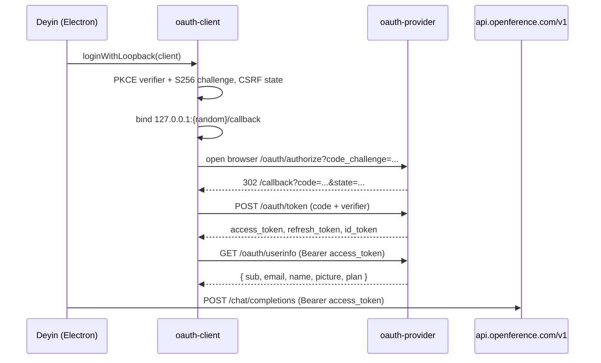

# Openference OAuth

Deyin signs in with Openference using standard OAuth 2.0 + PKCE. This repo provides both
sides so the flow works today and is reusable by any other CLI or app:

- `@deyin/oauth-provider` — the authorization server (deploy alongside Openference's API).
- `@deyin/oauth-client` — the client library (used by Deyin desktop, Deyin web, and any CLI).

## Why this exists

Openference currently authenticates API calls with a Bearer API key only. To offer a
"Sign in with Openference" button (and a shareable profile) instead of asking users to
paste keys, we add a thin OAuth layer that issues tokens which are themselves valid Bearer
credentials for `https://api.openference.com/v1`. One sign-in, one token, both identity and
model access.

## End-to-end flow (desktop)



## Client registration

Register each client with the provider (see `OAuthStorage.getClient`):

| Field | Deyin desktop | A third-party CLI |
| --- | --- | --- |
| `clientId` | `deyin-desktop` | your own id |
| `isPublic` | `true` (PKCE) | `true` |
| `redirectUris` | `http://127.0.0.1:*/callback` | `http://127.0.0.1:*/callback` |
| `grantTypes` | code, refresh, device | code, refresh, device |
| `allowedScopes` | `openid profile email offline_access model:invoke billing:manage` | subset as needed |

`billing:manage` is first-party only: the issuer drops it from the grant for any
client whose `oauth_clients.first_party` is 0, and the billing routes re-check that
flag. Without it, `/api/billing/select-plan` and `/api/user/billing/overview` answer
403 `Session login required` — they otherwise accept only a dashboard session token.
A token minted before the scope existed keeps its old scopes across refresh, so an
already-signed-in user has to sign in again once to manage billing in-app.

Loopback redirect URIs use a `*` wildcard port, matched per RFC 8252, so the client can
bind any free local port.

## Reusing this in another CLI

The whole point of splitting the client into `@deyin/oauth-client` is reuse. A separate
tool adds Openference login in a few lines:

```ts
import { OAuthClient } from "@deyin/oauth-client";
import { loginWithDevice, FileTokenStore } from "@deyin/oauth-client/node";

const client = new OAuthClient(
  {
    issuer: "https://api.openference.com",
    clientId: "my-cli",
    scopes: ["openid", "profile", "offline_access", "model:invoke"],
  },
  new FileTokenStore({ path: `${process.env.HOME}/.my-cli/creds.json` }),
);

await loginWithDevice(client, {
  onAuthorization: ({ userCode, verificationUri }) =>
    console.log(`Visit ${verificationUri} and enter ${userCode}`),
});

const token = await client.getAccessToken(); // Bearer for api.openference.com/v1
```

A complete runnable version is in
[`packages/openference/oauth-client/examples/cli-login.ts`](../packages/openference/oauth-client/examples/cli-login.ts).

## Token model

| Token | Format | Lifetime | Notes |
| --- | --- | --- | --- |
| Access | RS256 JWT (`at+jwt`) | 15 min | Verify via JWKS; use as Bearer for `/v1`. |
| Refresh | opaque | 30 days | Rotated on every use. |
| ID | RS256 JWT | 15 min | OIDC claims; only when `openid` granted. |

## Deploying the provider

The provider is a Hono app, so it runs on Node (`serve`) or Cloudflare Workers
(`export default app`). Production wiring:

1. Implement `OAuthStorage` over Openference's user database.
2. Replace the dev consent form (`routes/authorize.ts`) with Openference's existing
   Google/GitHub session + a consent step.
3. Load RS256 keys from a secret manager (`createOAuthProvider({ keys })`).
4. Set `corsOrigins` to the Deyin web origins.
